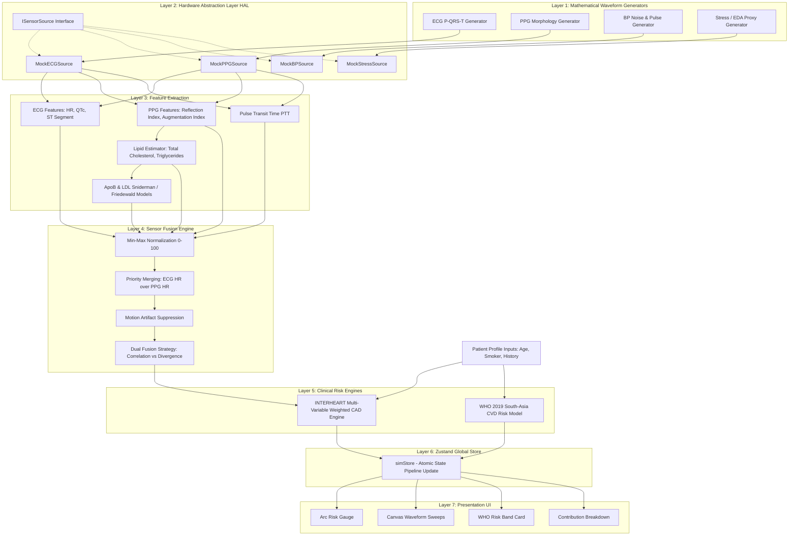

# CAD Risk Simulator — Architecture & Design Specification

> **Document Type:** System Architecture & Design Reference Document  
> **Project:** CAD (Coronary Artery Disease) Risk Monitor  
> **Version:** 1.0 (Phase 1 — Software Simulation Engine & Hardware Abstraction)  
> **Target Audience:** Engineering Team, System Architects, Clinical Software Reviewers  

---

## 1. Executive Summary & System Overview

The **CAD Risk Simulator** is an end-to-end, clinical-grade medical software architecture designed for continuous, multi-sensor monitoring and real-time risk estimation of Coronary Artery Disease (CAD) and Cardiovascular Disease (CVD).

The system models a complete biomedical telemetry pipeline, transforming raw physiological signals (ECG, PPG, Blood Pressure, EDA/Stress, Motion) and patient clinical profile parameters into:
1. A real-time **Composite CAD Risk Score (0–100)** derived from the landmark **INTERHEART Study** (Lancet 2004).
2. A population-validated **WHO 2019 10-Year CVD Risk Band** (Lancet Global Health 2019).
3. A two-tier **Metabolic-Vascular & Correlation-Based Sensor Fusion Engine** capable of detecting motion artifacts and dampening low-confidence optical estimates.

```
+-----------------------------------------------------------------------------------+
|                                 PATIENT INPUTS                                   |
|   Physiological Telemetry (ECG/PPG/BP)  +  Clinical Profile (Age/Smoker/History)   |
+-----------------------------------------------------------------------------------+
                                         │
                                         ▼
+-----------------------------------------------------------------------------------+
|                             7-LAYER PROCESSING PIPELINE                           |
|   Generators ➔ HAL ➔ Feature Extraction ➔ Fusion ➔ Risk Engine ➔ Store ➔ UI       |
+-----------------------------------------------------------------------------------+
                                         │
                                         ▼
+-----------------------------------------------------------------------------------+
|                                REAL-TIME OUTPUTS                                  |
|   CAD Composite Risk (0-100)  |  WHO 10-Yr CVD Band  |  Vascular Index  |  Waveforms |
+-----------------------------------------------------------------------------------+
```

---

## 2. High-Level Architecture (7-Layer Pipeline)

The system is organized into **7 strictly decoupled layers**, ensuring clear separation of concerns, testability, and zero coupling between UI components and mathematical signal processing.

```
┌───────────────────────────────────────────────────────────────────────────────────┐
│ Layer 1: Waveform Generators  (src/hal/generators/)                               │
│ Pure mathematical models generating synthetic ECG, PPG, BP, and Stress signals    │
└─────────────────────────────────────────┬─────────────────────────────────────────┘
                                          │
                                          ▼
┌───────────────────────────────────────────────────────────────────────────────────┐
│ Layer 2: Hardware Abstraction Layer (HAL)  (src/hal/)                             │
│ ISensorSource contract; Mock sources for simulation; BLE seam for Phase 2         │
└─────────────────────────────────────────┬─────────────────────────────────────────┘
                                          │
                                          ▼
┌───────────────────────────────────────────────────────────────────────────────────┐
│ Layer 3: Feature Extraction Engine  (src/features/)                               │
│ Extract HR, QTc (Bazett), ST segment, HRV (RMSSD), PTT, PPG lipid morphology      │
└─────────────────────────────────────────┬─────────────────────────────────────────┘
                                          │
                                          ▼
┌───────────────────────────────────────────────────────────────────────────────────┐
│ Layer 4: Sensor Fusion Engine  (src/fusion/)                                      │
│ Priority merging, Min-Max 0-100 normalization, Motion artifact detection          │
└─────────────────────────────────────────┬─────────────────────────────────────────┘
                                          │
                                          ▼
┌───────────────────────────────────────────────────────────────────────────────────┐
│ Layer 5: CAD Risk Engine  (src/riskEngine/)                                       │
│ INTERHEART weighted score (0-100) + WHO 2019 South-Asia non-lab CVD risk lookup   │
└─────────────────────────────────────────┬─────────────────────────────────────────┘
                                          │
                                          ▼
┌───────────────────────────────────────────────────────────────────────────────────┐
│ Layer 6: Global State Store  (src/store/simStore.ts - Zustand)                    │
│ Atomic pipeline execution results; isolated state selectors for optimal renders   │
└─────────────────────────────────────────┬─────────────────────────────────────────┘
                                          │
                                          ▼
┌───────────────────────────────────────────────────────────────────────────────────┐
│ Layer 7: Visualization & Dashboard UI  (src/App.tsx + src/components/)            │
│ Canvas waveform sweep, arc risk gauge, profile panel, contribution breakdown      │
└───────────────────────────────────────────────────────────────────────────────────┘
```

---

## 3. Comprehensive Data Flow & Component Architecture



---

## 4. Layer-by-Layer Deep Dive

### Layer 1: Waveform Generators (`src/hal/generators/`)
* **ECG Generator (`ecgGenerator.ts`)**: Synthesizes real-time P-QRS-T electrocardiogram waves using trigonometric Gaussian expansions. Dynamically scales cycle durations based on target Heart Rate and applies ST elevation/depression offsets and QT interval stretches.
* **PPG Generator (`ppgGenerator.ts`)**: Simulates optical absorption pulse wave morphology including the systolic peak, dicrotic notch, and diastolic wave. Adjusts reflection index ($RI$) and stiffness index ($SI$) based on vascular tone.
* **BP Generator (`bpGenerator.ts`)**: Generates arterial pressure waveforms with realistic systolic/diastolic pulse pressure variations and high-frequency physiological noise.
* **Stress Generator (`stressGenerator.ts`)**: Simulates Galvanic Skin Response (GSR/EDA) proxies and Heart Rate Variability (HRV) metrics under sympathetic arousal.

---

### Layer 2: Hardware Abstraction Layer (`src/hal/`)
The HAL provides a strict abstraction boundary (`ISensorSource`) separating software logic from physical hardware:

```typescript
export interface ISensorSource {
  readonly type: SensorType; // 'ecg' | 'ppg' | 'bp' | 'stress'
  init(): Promise<void>;
  read(): Promise<SensorReading>;
  getStatus(): SensorStatus; // 'simulated' | 'connected' | 'error'
}
```

* **Mock Implementations (`MockSensorSources.ts`)**: Mock classes wrap raw mathematical generators and provide parameter update hooks (`setParams()`) to reflect UI slider changes instantly.
* **Phase 2 Hardware Integration Seam**: To connect physical sensors (e.g., ESP32 with MAX30102 PPG sensor or AD8232 ECG sensor), an engineer creates a `BLESensorSource` implementing `ISensorSource`. **No changes are needed in Layers 3–7.**

---

### Layer 3: Feature Extraction Engine (`src/features/`)

#### 1. ECG & Cardiac Features
* **Heart Rate ($HR$)**: Extracted from R-peak detection across a moving buffer window.
* **QTc Bazett Correction**:
  $$QTc = \frac{QT}{\sqrt{RR}}$$
  Normalizes the QT interval for rate-dependent variation.
* **ST Segment Deviation**: Calculated relative to the isoelectric baseline (expressed in millivolts).

#### 2. Pulse Transit Time (PTT) & Cuffless BP
Calculates time delay between the peak of the ECG R-wave and the foot of the peripheral PPG pulse:
$$PTT = t_{\text{PPG foot}} - t_{\text{ECG R-peak}}$$
Applies the **Moens-Korteweg equation** and **Hughes arterial elasticity model**:
$$BP_{\text{cuffless}} = a \cdot \ln(PTT) + b$$

#### 3. PPG Pulse Wave Morphology Lipid Estimates
* **Total Cholesterol ($TC$) & Triglycerides ($TG$)**: Estimated from the PPG Augmentation Index ($AIx$) and Stiffness Index ($SI$):
  $$AIx = \frac{P_2}{P_1}$$
* **Apolipoprotein B ($ApoB$)**: Estimated via Sniderman's regression equation from non-HDL cholesterol:
  $$ApoB = 0.84 \cdot LDL + 0.16 \cdot (TC - HDL)$$
* **LDL Cholesterol**: Derived via the Friedewald formula:
  $$LDL = TC - HDL - \frac{TG}{5}$$

---

### Layer 4: Sensor Fusion Engine (`src/fusion/`)

#### 1. Min-Max Parameter Normalization
Maps raw physiological values onto standardized sub-score indices from **0 (Lowest Risk)** to **100 (Highest Risk)**:

| Parameter | Healthy Baseline | Normalization Range (0–100 Index) |
|---|---|---|
| Heart Rate | 60–80 bpm | $<40 \text{ bpm} \rightarrow 100$, $60\text{--}80 \rightarrow 0$, $>150 \text{ bpm} \rightarrow 100$ |
| Systolic BP | 110–120 mmHg | $<120 \rightarrow 0$, $140 \rightarrow 50$, $\ge 180 \text{ mmHg} \rightarrow 100$ |
| HRV (RMSSD) | $>50 \text{ ms}$ | $>80 \text{ ms} \rightarrow 0$, $<20 \text{ ms} \rightarrow 100$ |
| QTc Bazett | $<430 \text{ ms}$ | $<440 \text{ ms} \rightarrow 0$, $>500 \text{ ms} \rightarrow 100$ |
| ST Segment | $0.00 \text{ mV}$ | $<0.05 \text{ mV} \rightarrow 0$, $>0.20 \text{ mV} \rightarrow 100$ |

#### 2. Dual Fusion Strategy: Correlation vs. Divergence

```
                    ┌─────────────────────────────────────────┐
                    │          RAW SENSOR READINGS            │
                    └────────────────────┬────────────────────┘
                                         │
             ┌───────────────────────────┴───────────────────────────┐
             ▼                                                       ▼
┌──────────────────────────┐                            ┌──────────────────────────┐
│   CORRELATION FUSION     │                            │    DIVERGENCE FUSION     │
│ (Physically Independent) │                            │ (Shared Optical Modality)│
├──────────────────────────┤                            ├──────────────────────────┤
│ Signals: ECG + PPG + ACC │                            │ Signals: PPG TC + PPG TG │
│ Cross-correlates motion  │                            │ Tier 1: PPGVascularIndex │
│ noise against cardiac    │                            │ Tier 2: Check divergence │
│ signal. Dampens reading  │                            │ against ApoB (Lab anchor)│
│ confidence if correlated.│                            │ Prevents artifact loop.  │
└──────────────────────────┘                            └──────────────────────────┘
```

* **Correlation-Based Fusion (Cardiac / Motion)**: ECG electrical, PPG optical, and Accelerometer motion originate from distinct physical mechanisms. High cross-correlation between movement spikes and optical noise triggers an artifact flag, dampening confidence.
* **Two-Tier Divergence-Based Fusion (Metabolic-Vascular)**: Cuffless BP, PPG Total Cholesterol, and PPG Triglycerides all share a single optical PPG pulse wave. Cross-correlating them directly would amplify optical noise loops. Instead:
  - **Tier 1**: Merges optical waveform indices into a composite index ($PPGVascularIndex$).
  - **Tier 2**: Measures divergence against $ApoB$ (an independent laboratory anchor parameter).

---

### Layer 5: Clinical CAD Risk Engine (`src/riskEngine/`)

#### 1. INTERHEART Multi-Variable CAD Scoring Engine
Computes a composite **0–100 CAD Risk Score** using weighted Population Attributable Risk (PAR%) data from the **INTERHEART Study** (*Yusuf et al., Lancet 2004*):

$$\text{CAD Risk Score} = \sum_{i=1}^{10} \left( w_i \cdot S_i \right) + \text{Modifiers}$$

| Parameter Sub-score ($S_i$) | Assigned Weight ($w_i$) | INTERHEART PAR% | Clinical Rationale |
|---|---|---|---|
| **ApoB / Lipid Index** | **0.22** | 49.2% | Leading atherogenic predictor |
| **Blood Pressure Sub-score** | **0.22** | 17.9% | Major vascular wall shear factor |
| **Smoking Status Sub-score** | **0.16** | 35.7% | Endothelial dysfunction catalyst |
| **Psychosocial Stress** | **0.12** | 28.8% | Sympathetic activation factor |
| **Heart Rate** | 0.08 | — | Myocardial oxygen demand |
| **HRV (RMSSD)** | 0.06 | — | Autonomic tone marker |
| **QTc Interval** | 0.05 | — | Ventricular repolarization marker |
| **ST Segment Elevation/Depression** | 0.05 | — | Acute ischemic indicator |
| **Total Cholesterol (PPG est.)** | 0.02 | — | Secondary lipid marker |
| **Triglycerides (PPG est.)** | 0.02 | — | Secondary lipid marker |

##### Clinical Risk Classification Bands:
* **0–34**: **Low CAD Risk** (Cyan / Accent)
* **35–64**: **Moderate CAD Risk** (Amber Warning)
* **65–100**: **High CAD Risk** (Red Alert)

#### 2. WHO 2019 South-Asia 10-Year CVD Risk Model (`whoRiskChart.ts`)
Parallel population screening calculation based on the WHO 2019 non-laboratory South-Asia chart (*Lancet Glob Health 2019*):

$$\text{WHO Score Points} = P_{\text{Age}} + P_{\text{Sex}} + P_{\text{Smoker}} + P_{\text{SBP}} + P_{\text{BMI}}$$

| Factor | Scoring Matrix |
|---|---|
| **Age** | 40–44 (+1), 45–49 (+2), 50–54 (+3), 55–59 (+4), 60–64 (+5), 65–69 (+6), 70+ (+7) |
| **Male Sex** | +1 point |
| **Current Smoker** | +3 points |
| **Systolic BP** | 120–139 (+1), 140–159 (+2), 160–179 (+4), $\ge 180$ (+6) |
| **BMI** | 25–29.9 (+1), $\ge 30$ (+2) |

##### Output WHO Bands:
* $<4 \text{ points} \rightarrow <10\%$ **Low Risk**
* $4\text{--}6 \text{ points} \rightarrow 10\text{--}<20\%$ **Low-Moderate Risk**
* $7\text{--}9 \text{ points} \rightarrow 20\text{--}<30\%$ **Moderate-High Risk**
* $\ge 10 \text{ points} \rightarrow \ge 30\%$ **High Risk**

---

### Layer 6: Global State Management (`src/store/simStore.ts`)

Powered by **Zustand v5** for atomic state updates and granular selector subscriptions:

```typescript
export interface SimState {
  params: MockParams;
  patientProfile: PatientProfile;
  snapshot: PipelineSnapshot | null;
  riskResult: CADRiskResult | null;
  ecgBuffer: number[];
  ppgBuffer: number[];
  riskTrend: { timestamp: number; score: number }[];
  
  // Actions
  setParams: (p: Partial<MockParams>) => void;
  setPatientProfile: (p: Partial<PatientProfile>) => void;
  updatePipelineData: (data: PipelineUpdate) => void;
}
```

* **`usePipeline.ts` (Pipeline Driver)**: React hook running on a 1000ms interval. Chains Layers 1–5 in sequence and dispatches a single atomic `updatePipelineData()` action to prevent intermediate UI flickers.

---

### Layer 7: Dashboard UI & Visual Specifications

```
+-----------------------------------------------------------------------------------+
| TOP BAR: Brand Title | Sensor Status | Scenario Presets | Risk Score | Live Clock |
+-----------------------+----------------------------------+------------------------+
| LEFT COLUMN (224px)   | CENTER COLUMN (Flex-1)           | RIGHT COLUMN (256px)   |
|                       |                                  |                        |
| • Patient Profile     | • ECG Waveform Canvas            | • Arc Risk Gauge       |
|   Accordion           |   (Live trace sweep)             |   (270° arc rendering) |
| • Parameter Sliders   | • PPG Waveform Canvas            | • WHO 10-Yr CVD Card   |
|   (HR, BP, HRV, ST)   |   (Live optical pulse)           | • Parameter            |
|                       | • Readout Cards (BP, HRV, ST)    |   Contributions (10x)  |
|                       | • Lipid Estimates (TC, TG, ApoB) |                        |
+-----------------------+----------------------------------+------------------------+
| FOOTER: CAD Risk Trend Sparkline (30-sample historical plot)                      |
+-----------------------------------------------------------------------------------+
```

---

## 5. Summary of Mathematical Specifications

| Specification | Mathematical Formula / Algorithm | Reference Source |
|---|---|---|
| **QTc Bazett Correction** | $QTc = QT / \sqrt{RR}$ | Bazett, Heart 1920 |
| **Sniderman ApoB Model** | $ApoB = 0.84 \cdot LDL + 0.16 \cdot (TC - HDL)$ | Sniderman et al., Circ 2003 |
| **Friedewald LDL Model** | $LDL = TC - HDL - (TG / 5)$ | Friedewald et al., Clin Chem 1972 |
| **Moens-Korteweg PTT BP** | $BP = a \cdot \ln(PTT) + b$ | Proença et al., IEEE TBME 2018 |
| **INTERHEART Weighted Score**| $\text{Score} = \sum (w_i \cdot S_i) + \text{Modifiers}$ | Yusuf et al., Lancet 2004 |
| **WHO Non-Lab CVD Chart** | Points matrix based on Age, Sex, Smoker, SBP, BMI | WHO / Lancet Glob Health 2019 |

---

## 6. Phase 2 BLE Hardware Integration Seam

To transition from Phase 1 (Software Simulation) to Phase 2 (Live Physical Hardware):

```
                        ┌───────────────────────────────┐
                        │      ISensorSource (HAL)      │
                        └───────────────┬───────────────┘
                                        │
                 ┌──────────────────────┴──────────────────────┐
                 ▼                                             ▼
  ┌─────────────────────────────┐               ┌─────────────────────────────┐
  │      MockSensorSources      │               │      BLESensorSource        │
  │     (Phase 1 - Current)     │               │     (Phase 2 - Hardware)    │
  ├─────────────────────────────┤               ├─────────────────────────────┤
  │ Uses mathematical waveform  │               │ Connects to ESP32 via BLE   │
  │ generators & UI sliders     │               │ Streams MAX30102/AD8232     │
  └─────────────────────────────┘               └─────────────────────────────┘
```

1. Implement `BLESensorSource` extending `ISensorSource`.
2. Connect to ESP32 microcontroller over Web Bluetooth API (`navigator.bluetooth`).
3. Stream raw byte buffers into feature extraction (`src/features/`).
4. **Layers 3 through 7 remain 100% untouched.**
